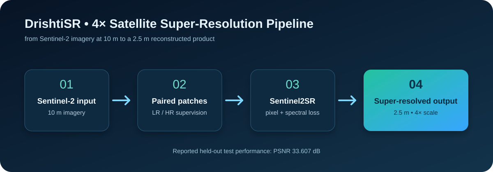
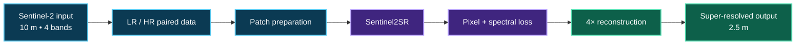
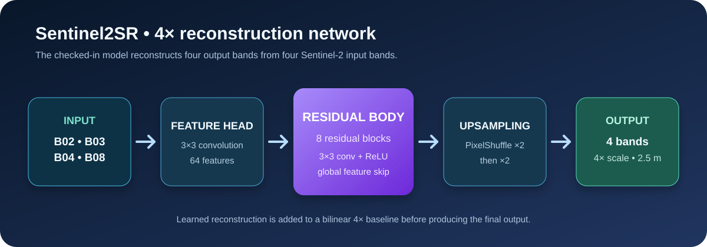
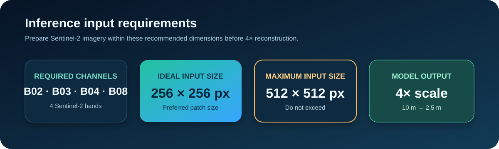

<div align="center">



# DrishtiSR

### AI-powered 4× super-resolution for Sentinel-2 satellite imagery

[](#the-challenge)


*Turning 10 m Sentinel-2 imagery into a finer, model-reconstructed 2.5 m product—with scientific limits kept visible.*

</div>

> **Research note:** Super-resolution estimates fine detail from learned patterns. It is not a direct 2.5 m satellite observation, so outputs should be reviewed before high-stakes geospatial use.

## The challenge

Sentinel-2 makes globally useful 10 m imagery available, yet mapping and planning workflows often benefit from finer spatial detail. Enlarging an image with interpolation cannot recover spatial relationships that were not represented in the original grid.

**DrishtiSR** learns a supervised **4× spatial mapping — 10 m → 2.5 m** — from paired low-resolution (LR) and high-resolution (HR) imagery. It uses the **Sentinel2SR** architecture and combines pixel reconstruction with spectral consistency during training.

## At a glance

| Item | Project fact |
| --- | --- |
| Source imagery | Sentinel-2 at 10 m |
| Reconstruction | 4× spatial scale to 2.5 m |
| Bands | 4 bands — B02, B03, B04, B08 |
| Training data | Paired LR / HR dataset |
| Model | Sentinel2SR |
| Training objective | Pixel loss + spectral loss |
| Held-out test result | **PSNR: 33.607 dB** |

## 10 m → 2.5 m pipeline



1. **Prepare** paired LR / HR samples for supervised learning.
2. **Learn** the 4× mapping with Sentinel2SR, guided by pixel and spectral losses.
3. **Reconstruct** a denser output grid corresponding to 2.5 m resolution.

## Sentinel2SR architecture

<p align="center">
  
</p>

The checked-in inference model accepts four Sentinel-2 channels: **B02 (blue), B03 (green), B04 (red), and B08 (NIR)**. It extracts features, processes them through **8 residual blocks**, upsamples twice with PixelShuffle for 4× scaling, and adds a bilinear residual baseline to the learned reconstruction.

During training, the project combines:

- **Pixel loss** for per-pixel reconstruction fidelity.
- **Spectral loss** to help preserve relationships across the four spectral bands.

## Dataset, training, and result

The model is trained with a **paired LR / HR dataset**, allowing it to learn a supervised mapping rather than merely enlarging pixels. The current reported held-out test result is:

<div align="center">

| Metric | Result |
| :--- | ---: |
| **PSNR** | **33.607 dB** |

</div>

PSNR is a reconstruction-fidelity metric expressed in decibels; it is not a percentage improvement. A baseline comparison should be reported only when it is evaluated on the same held-out split.

## Inference input requirements

<p align="center">
  
</p>

| Parameter | Requirement |
| --- | --- |
| Satellite source | Sentinel-2 imagery |
| Required bands | B02, B03, B04, B08 (4 bands) |
| Spatial resolution | 10 m input |
| **Ideal input size** | **256 × 256 px** |
| **Maximum input size** | **512 × 512 px** |
| Super-resolution scale | 4× |
| Reconstructed resolution | 2.5 m |

For consistent inference, prepare inputs at the ideal size whenever possible. Do not submit images larger than **512 × 512 px**. The 4× model scale means a 256 × 256 input corresponds to a 1024 × 1024 output grid.

## Run locally

Clone the repository, then run the web client and API in separate terminals.

```bash
git clone https://github.com/Spideyxperince/DrishtiSR-AI-Satellite-SuperResolution.git
cd DrishtiSR-AI-Satellite-SuperResolution
```

### Frontend

```bash
cd frontend
npm install
npm run dev
```

### Backend

```bash
cd backend
pip install -r requirements.txt
python -m uvicorn app.main:app --reload
```

For model-backed processing, place the compatible checkpoint at `backend/app/ml/weights/sentinel2_sr_inference.pth`. The checkpoint is intentionally not tracked in this repository.

## Repository structure

```text
.
├── ai/
│   ├── inference/          # Baseline inference utility
│   ├── models/             # Model experiments / source
│   └── preprocessing/      # Training-pair preparation
├── assets/                 # README diagrams
├── backend/
│   └── app/
│       ├── ml/             # Sentinel2SR inference architecture
│       ├── routes/         # API endpoints
│       └── services/       # Raster and SR processing services
├── frontend/               # React + TypeScript + Vite client
└── README.md
```

## Application flow

<p align="center">
  
</p>

The repository includes a React/TypeScript frontend and a FastAPI backend. The backend loads the four-band Sentinel2SR model once, runs 4× reconstruction, and writes a spatially aligned output raster.

## Limitations and next steps

- Super-resolved detail is **model-inferred**, not newly observed by Sentinel-2.
- Results may vary across geography, land cover, season, atmosphere, and source-pair alignment.
- A strong PSNR alone does not establish suitability for downstream decisions; spectral and geospatial checks remain important.
- The documented input-size guidance should be applied by users; teams integrating the API should also enforce it at the upload boundary.
- Publish reproducible training settings, a checkpoint, fixed evaluation split, and fair baseline comparisons as they become available.

## License

Released under the [MIT License](LICENSE).
